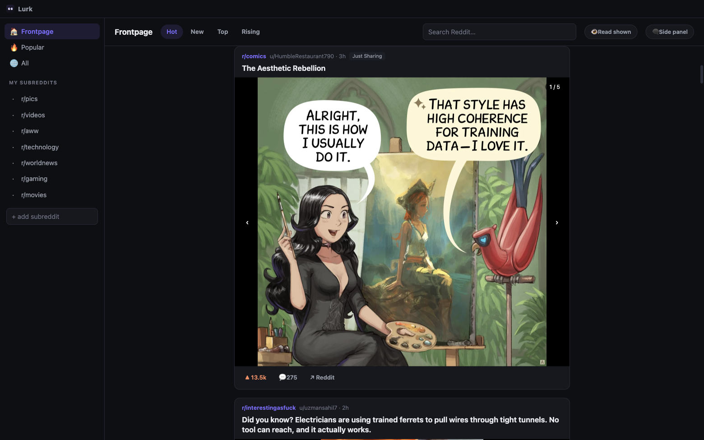
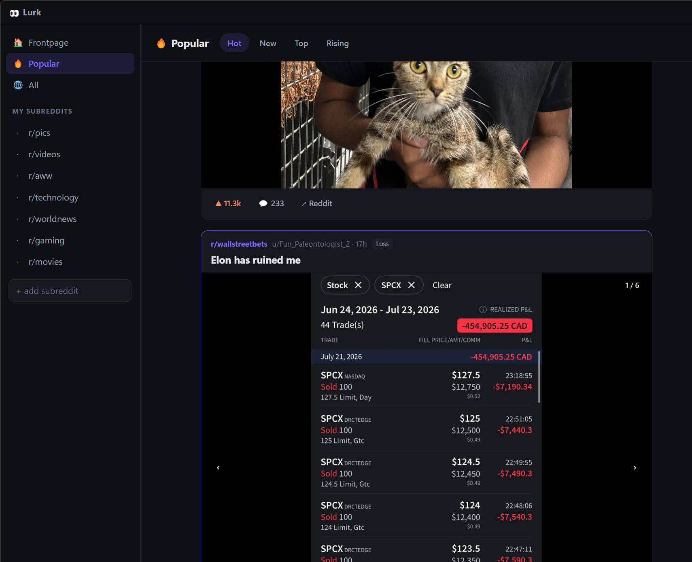
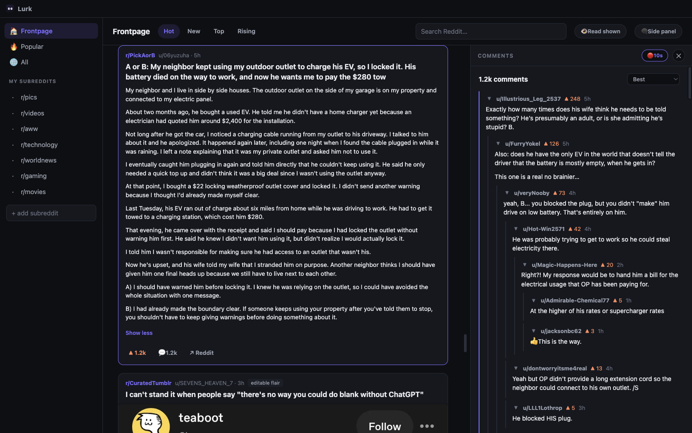

<div align="center">


# Lurk

**A fast, dark, media-first Reddit viewer for your desktop.**

Built because every Windows Reddit client died, the website is a cluttered mess,
and doom-scrolling on a phone at a desk with a perfectly good monitor is silly.

</div>

---

## Why

Reddit killed most third-party clients when it locked down its API. What's left on
desktop is either abandoned, wrapped-website jank, or ad-stuffed. Lurk is the
opposite: a native-feeling window with no ads, no login, no tracking, no
"open in app" nags — just your subreddits, big media, and readable comments.

## Features

- **Media-first feed** — large inline images, galleries with arrows, looping GIFs,
  Reddit-hosted video **with sound** (HLS), YouTube embeds, click-to-zoom lightbox
- **Comments the way you want them** — side panel next to the feed (drag the divider
  to resize) or a popup overlay; one click toggles the mode
- **Threaded comments** — collapse/expand any thread, OP highlighting, inline
  image previews for image links inside comments
- **Full text posts inline** — long selftext expands in place with
  *Read more / Show less*, fully formatted (paragraphs, links, quotes, code)
- **Your subreddits** — pinned list with autocomplete search, saved locally
- **Hot / New / Top / Rising** with time ranges, plus site-wide search
- **NSFW blurred** until you click, external links open in your real browser
- **Dark, quiet UI** — custom titlebar, no chrome, no clutter

## Screenshots

| Feed | Comments side panel |
| --- | --- |
|  |  |

Long text posts expand right in the feed — read the whole thing without leaving your place:



## Download

Grab the latest installer from **[Releases](https://github.com/jampick/lurk/releases)**:

| OS | File | Auto-updates |
| --- | --- | --- |
| Windows | `Lurk Setup x.y.z.exe` (NSIS installer) | Yes |
| Linux (any distro) | `Lurk-x.y.z.AppImage` | Yes |
| Linux (Debian/Ubuntu) | `.deb` | Notified in app |
| Linux (Arch/Omarchy) | `.pacman` | Notified in app |
| macOS | `Lurk-x.y.z.dmg` | Notified in app |

Installers are built automatically by CI for every tagged version.
None are code-signed yet, so Windows SmartScreen / macOS Gatekeeper will ask you
to confirm the first launch (macOS: right-click → Open).

### Staying up to date

Lurk checks GitHub for new releases shortly after launch and every few hours
after that. When one turns up you get a desktop notification and a banner in
the corner of the window.

On **Windows** and the **Linux AppImage**, the update downloads itself in the
background and the banner offers a **Restart** button — that's the whole
process. On macOS and `.deb`/`.pacman` installs, Lurk tells you and links to the
download; those formats are managed by the system (or, on macOS, blocked from
self-updating until the app is signed), so it doesn't try to update behind your
back.

On Arch or Omarchy, take the **AppImage** if you want updates to arrive on their
own. There's a **Check for updates** button at the bottom of the sidebar, next
to the version number, and updates are off entirely when running from source.

> **Pinning to the Windows taskbar:** pin the *installed* app (Start menu → Lurk).
> Pinning a dev instance run via `npm start` pins `electron.exe` and shows
> Electron's default icon instead of Lurk's.

## Run from source

```bash
git clone https://github.com/jampick/lurk.git
cd lurk
npm install
npm start
```

Requires Node 20+. Same codebase on Windows, macOS, and Linux — the titlebar
adapts per platform. `npm run dist` builds the installer for whichever OS
you're on.

```bash
npm test           # lint + unit tests
npm run test:e2e   # launches the real app and smoke-tests it
```

Patches welcome — see [CONTRIBUTING.md](CONTRIBUTING.md) for the issue → PR →
auto-merge flow, [docs/VERSIONING.md](docs/VERSIONING.md) for the versioning
scheme, and [RELEASING.md](RELEASING.md) for how releases are cut.

## How it works (the interesting bits)

- **No API key needed.** Reddit's edge blocks anonymous JSON requests with a 403,
  but serves them happily to anything that looks like a browser session. Lurk loads
  reddit.com once in a hidden window at startup to pick up ordinary session cookies,
  then reads Reddit's public JSON listings through Chromium's network stack. If
  Reddit ever 403s mid-session, Lurk re-warms and retries automatically.
- **Video with sound.** Reddit serves video and audio as separate DASH streams;
  Lurk plays the HLS master playlist via `hls.js`, so you get both — with a
  soundless-mp4 fallback if HLS fails.
- **Comments are Reddit's own sanitized HTML**, rendered under a strict
  Content-Security-Policy (no inline script, no external script, no plugins),
  with every link forced through the system browser.

## Security posture

- Renderer runs sandboxed with `contextIsolation` on and `nodeIntegration` off —
  page content has no filesystem or Node access
- Strict CSP: no remote or inline scripts can execute, period
- The only IPC surface is "fetch this reddit.com path" and "open this http(s) URL
  in the system browser", both validated in the main process
- All permission requests (camera, mic, location, …) are denied
- Dependencies: `electron`, `hls.js` and `electron-updater`, `npm audit` clean

## Roadmap

- [x] Automatic update notifications
- [ ] Code signing (Windows SmartScreen, macOS auto-update)
- [ ] Keyboard navigation (j/k through posts)
- [ ] Optional Reddit login for your real home feed
- [ ] Multi-column grid layout
- [ ] Auto-collapse downvoted comments

## License

[MIT](LICENSE)
